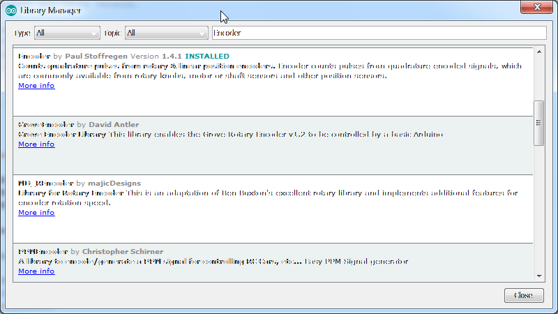

# octopus-rotary-encoder
Rotary encoder example for IoT Octopus, the badge for IoT Evaluation by fab-lab.eu

## External libraries
This example requires an external Arduino library:

Encoder Library (Version 1.4.1) by PaulStoffregen

https://www.pjrc.com/teensy/td_libs_Encoder.html

https://github.com/PaulStoffregen/Encoder

## Hardware purchase
* Octopus IoT Badge: https://www.tindie.com/products/FabLab/iot-octopus-badge-for-iot-evaluation/
* Rotary Encoder: https://www.exp-tech.de/sensoren/sonstige/6032/rotary-encoder-extras (Germany) or https://www.adafruit.com/product/377

## Functionality
* Turning the button to the right or left increases or decreases a counter.
* Pressing the button resets the counter

